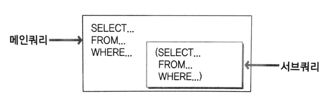

# 02. SQL 기본 및 활용

## 02.SQL 활용

### 순수 관계 연산자와 SQL 문장 비교

- SELECT 연산은 WHERE 절로 구현

- PROJECT 연산은 SELECT 절로 구현

- (NATURAL) JOIN 연산은 다양한 JOIN 기능으로 구현

- DEVIDE 연산은 현재 사용되지 않음

### ANSI/ISO SQL에서 표시하는 FROM 절의 JOIN 형태

- INNER JOIN

- NATURAL JOIN

- USING 조건절

- ON 조건절

- CROSS JOIN

- OUTER JOIN(LEFT, RIGHT, FULL)

### INNER JOIN

INNER JOIN은 OUTER JOIN과 대비하여 내부 JOIN이라고 하며 JOIN 조건에서 동일한
값이 있는 행만 반환한다.

### CROSS JOIN

테이블 간 JOIN 조건이 없는 경우 생길 수 있는 모든 데이터의 조합을 말한다.
결과는 양쪽 집합의 M*N 건의 데이터 조합이 발생한다.

### LEFT OUTER JOIN

조인 수행시 먼저 표기된 좌측 테이블에 해당하는 데이터를 먼저 읽은 후, 나중 표기된 우측 테이블에서 JOIN 대상 데이터를 읽어온다.
즉, Table A와 B가 있을 때(Table 'A'가 기준이 됨), A와 B를 비교해서 B의 JOIN 칼럼에서 같은 값이 있을 때 그 해당 데이터를 가져오고, B의 JOIN 칼럼에서 같은 값이 없는 경우에는 B 테이블에서 가져오는 칼럼들은 NULL 값으로 채운다.

### FULL OUTER JOIN

조인 수행시 좌측, 우측 테이블의 모든 데이터를 읽어 JOIN하여 결과를 생성한다. 즉, TABLE A와 B가 있을 때(Table 'A', 'B' 모두 기준이 됨), RIGHT OUTER JOIN과 LEFT OUTER JOIN의 결과를 합집합으로 처리한 결과와 동일하다. 

### OUTER JOIN 문장 예시

- LEFT OUTER JOIN

    SELECT X.KEY1,Y.KEY2
    FROM TAB1 X LEFT OUTER JOIN TAB2 Y
    ON (X.KEY1=Y.KEY2)

- RIGHT OUTER JOIN

    SELECT X.KEY1,Y.KEY2
    FROM TAB1 X RIGHT OUTER JOIN TAB2 Y
    ON (X.KEY1=Y.KEY2)

- FULL OUTER JOIN

    SELECT X.KEY1,Y.KEY2
    FROM TAB1 X FULL OUTER JOIN TAB2 Y
    ON (X.KEY1=Y.KEY2)    

### 집합 연산자의 종류

|집합 연산자|연산자의 의미|
|---|---|
|UNION|여러 개의 SQL문의 결과에 대한 합집합으로 결과에서 모든 중복된 행은 하나의 행으로 만든다.|
|UNION ALL|여러 개의 SQL문의 결과에 대한 합집합으로 중복된 행도 그대로 결과로 표시된다. 즉, 단순히 결과만 합쳐놓은 것이다. 일반적으로 여러 질의 결과가 상호 배타적인(Exclusive)일 때 많이 사용한다. 개별 SQL문의 결과가 서로 중복되지 않는 경우, UNION과 결과가 동일하다. (결과의 정렬 순서에는 차이가 있을 수 있음)|
|INTERSECT|여러 개의 SQL문의 결과에 대한 교집합이다. 중복된 행은 하나의 행으로 만든다.|
|EXCEPT|앞의 SQL문의 결과에서 뒤의 SQL문의 결과에 대한 차집합이다. 중복된 행은 하나의 행으로 만든다. (일부 데이터베이스는 MINUS를 사용함)|

### 집합연산자를 사용했을 때 ORDER BY

SELECT 칼럼명1, 칼럼명2, ...

FROM 테이블명1

[WHERE 조건식]

[[GROUP BY 칼럼이나 표현식]]

[[HAVING 그룹조건식]]

**집합연산자**

SELECT 칼럼명1, 칼럼명2, ...

FROM 테이블명1

[WHERE 조건식]

[[GROUP BY 칼럼이나 표현식]]

[[HAVING 그룹조건식]]

[ORDER BY 1,2 ASC또는 DESC];

-> ORDER BY는 집합 연산을 적용한 최종 결과에 대한 정렬 처리이므로 가장 마지막 줄에 한번만 기술한다.

### 일반 집합 연산자를 SQL과 비교

- UNION 연산은 UNION 기능으로

- INTERSECTION 연산은 INTERSECTION 기능으로

- DIFFERENCE 연산은 EXCEPT(Oracle은 MINUS) 기능으로

- PRODUCT 연산은 CROSS JOIN 기능으로 구현되었다.

### PRIOR

CONNECT BY절에 사용되며, 현재 읽은 칼럼을 지정한다.
PRIOR 자식 = 부모 형태를 사용하면 계층구조에서 부모 데이터에서 자식 데이터(부모 -> 자식) 방향으로 전개하는 순방향 전개를 한다.
그리고 PIROR 부모 = 자식 형태를 사용하면 반대로 자식 데이터에서 부모 데이터(자식 -> 부모) 방향으로 전개하는 역방향 전개를 한다.

### START WITH

START WITH 절은 계층 구조 전개의 시작 위치를 지정하는 구문이다. 즉, 루트 데이터를 지정한다.(액세스)

### ORDER SIBLINGS BY

형제 노드(동일 LEVEL) 사이에서 정렬을 수행한다.

### 계층형 질의문

테이블에 계층형 데이터가 존재하는 경우 데이터를 조회하기 위해서 계층형 질의(Hierarchical Query)를 사용한다.
계층형 데이터란 동일 테이블에 계층적으로 상위와 하위 데이터가 포함된 데이터를 만한다.
예를 들어, 사원 테이블에서는 사원들 사이에 상위 사원(관리자)과 하위 사원 관계가 존재하고 조직 테이블에서는 조직들 사이에 상위 조직과 하위 조직 관계가 존재한다.

### SELF JOIN

샐프 조인(SELF JOIN)이란 동일 테이블 사이의 조인을 말한다. 따라서 FROM 절에 동일 테이블이 두 번 이상 나타난다. 동일 테이블 사이의 조인을 수행하면 테이블과 칼럼 이름이 모두 동일하기 때문에 식별을 위해 반드시 테이블 별칭(Alias)를 사용해야 한다.

### 셀프 조인(Self join) 문장

SELECT ALIAS명1.칼럼명, ALIAS명2.칼럼명, ...

FROM 테이블 ALIAS명1,테이블 ALIAS명2,

WHERE ALIAS명1.칼럼명2 = ALIAS명2.칼럼명1;

### 메인쿼리와 서브쿼리

### 반환되는 데이터의 형태에 따른 서브쿼리 분류

|서브쿼리 종류|설명|
|---|---|
|Single Row 서브쿼리 (단일 행 서브쿼리)|서브쿼리의 실행 결과가 항상 1건 이하인 서브쿼리를 의미한다. 단일 행 서브쿼리는 단일 행 비교 연산자와 함께 사용된다. 단일 행 비교 연산자에는 =, <, <=, >, >=, <> 이 있다.|
|Multi Row 서브쿼리 (다중 행 서브쿼리)|서브쿼리의 실행 결과가 여러 건인 서브쿼리를 의미한다. 다중행 서브쿼리는 다중 행 비교 연산자와 함께 사용된다. 다중 행 비교 연산자에는 IN, ALL, ANY, SOME, EXISTS가 있다.|
|Multi Column 서브쿼리 (다중 칼럼 서브쿼리)|서브쿼리의 실행 결과로 여러 칼럼을 반환하다. 메인쿼리의 조건절에 여러 칼럼을 동시에 비교할 수 있다. 서브쿼리와 메인쿼리에서 비교하고자 하는 칼럼 개수와 칼럼의 위치가 동일해야 한다.|

### 서브쿼리를 사용시 주의사항

1. 서브쿼리를 괄호로 감싸서 사용한다.

2. 서브쿼리는 단일 행(Single query) 또는 복수 행(Multi Row) 비교 연산자와 함께 사용 가능하다. 단일 행 비교 연산자는 서브쿼리의 결과가 반드시 1건 이하이어야 하고 복수 행 비교 연산자는 서브쿼리의 결과 건수와 상관없다.

3. 서브쿼리에서는 ORDER BY를 사용하지 못한다. ORDER BY절은 SELECT절에서 오직 한 개만 올 수 있기 때문에 ORDER BY절은 메인쿼리의 마지막 문장에 위치해야 한다.

### Inline View(인라인 뷰)

FROM 절에서 사용되는 서브쿼리를 인라인 뷰(Inline View)라고 한다.
서브쿼리의 결과가 마치 실행 시에 동적으로 생성된 테이블인 것처럼 사용할 수 있다. 인라인 뷰는 SQL문이 실행될 때만 임시적으로 생성되는 동적인 뷰이기 때문에 데이터베이스에 해당 정보가 저장되지 않는다.

### 뷰 사용의 장점

- 독립성

    테이블 구조가 변경되어도 뷰를 사용하는 응용프로그램은 변경하지 않아도 된다.

- 편리성

    복잡한 질의를 뷰로 생성함으로써 관련 질의를 단순하게 작성할 수 있다. 또한 해당 형태의 SQL문을 자주 사용할 때 뷰를 이용하면 편리하게 사용할 수 있다.

- 보안성

    직원의 급여정보와 같이 숨기고 싶은 정보가 존재한다면, 뷰를 생성할 때 해당 칼럼을 빼고 생성함으로써 사용자에게 정보를 감출 수 있다.

### GROUP BY 종류

- ROLLUP 

    나열된 컴럼에 대해 계층 구조로 집계을 출력하는 함수

- CUBE

    결합 가능한 모든 값에 대하여 다차원 집계을 생성

- GROUPING SETS

    계층구조 없이 지역에 대한 합계와 월별 합계를 각각 생성하게 된다.

### 윈도우 함수(Window Function, Analytic Function)

- Partition과 Group By 구문은 의미적으로 유사

- Partition 구문이 없으면 전체 집합을 하나의 Partition으로 정의한것과 동일하다.

- 윈도우 함수 적용 범위는 Partition을 넘을 수 없다.

### RANK 함수

RANK 함수는 ORDER BY를 포함한 QUERY 문에서 특정 항목(칼럼)에 대한 순위를 구하는 함수이며 동일한 값에 대해서는 동일한 순위를 부여하게 된다.

